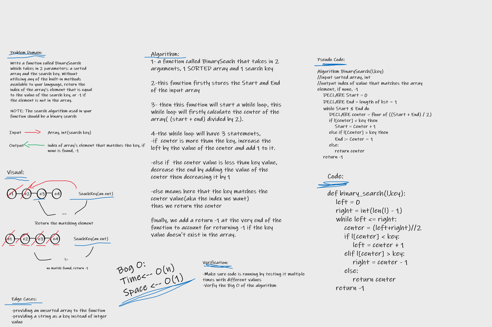

# Array Binary Search

Write a function called BinarySearch which takes in 2 parameters: a sorted array and the search key. Without utilizing any of the built-in methods available to your language, return the index of the array’s element that is equal to the value of the search key, or -1 if the element is not in the array.

NOTE: The search algorithm used in your function should be a binary search.

## Whiteboard Process

## Approach & Efficiency

I approached this by firstly analyzing what could be the solution, I had came up with couple of solutions but I was unsure, evntually I refered to the provided resource and I had to only edit couple of things in my algorithm to get it up and running.

It is effecient as it can find any index of provided value within an Sorted array by only doing 3 steps instead of looping over each and every element, 4 step required if the value doesn't exist inside the sorted array.

