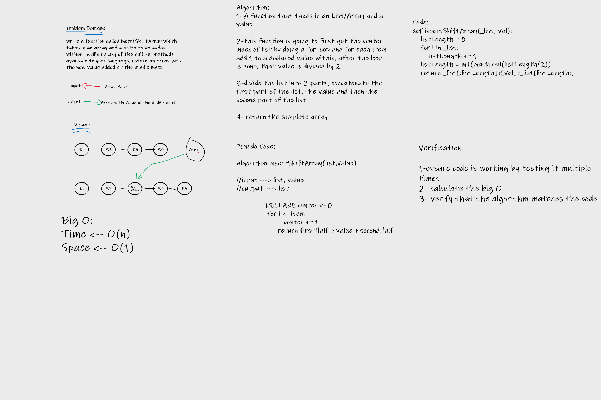

# Array Insert Shift
Write an algorthim that solves the problem of adding a value to the middle of a given list without using any built-in functions.

## Whiteboard Process

## Approach & Efficiency

I started by breaking down what the problem is, then after figuring the problem out, I was able to come with the solution of first getting the center by using a for loop to count how many items are in the loop and dividing the final value by 2, then dividing the list into two parts using the center index, adding the value in between using concatenation and finally returning the full list.

The alogorithm is Efficient as it uses only 2 lines and a single for loop.

