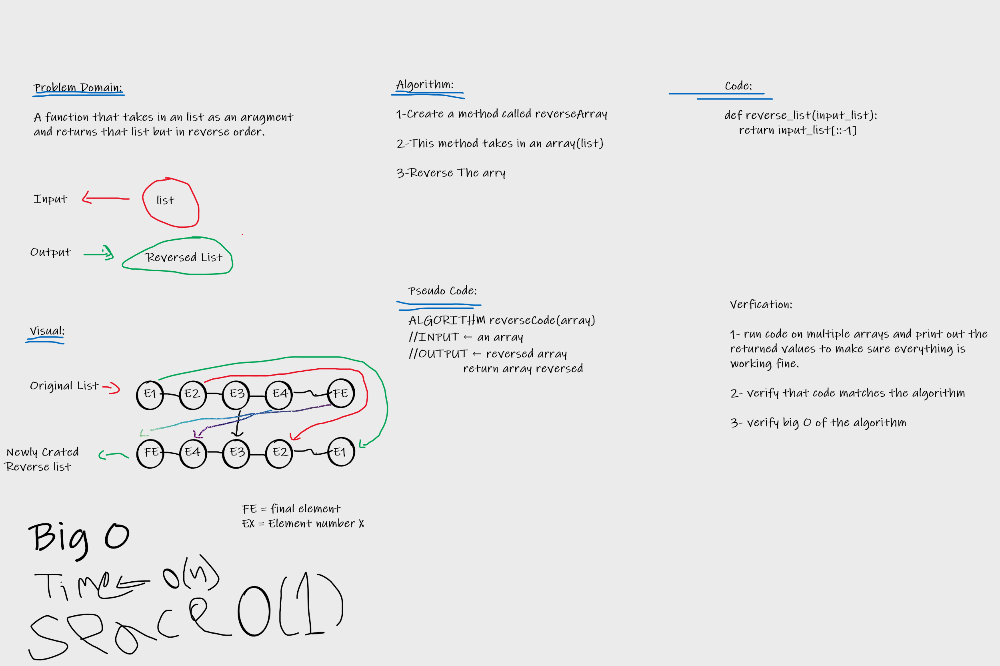

# Reverse an Array
Come up with an algorithm to reverse an input array without using any built in functions such as reverse() and return the reversed array.

## Whiteboard Process

## Approach & Efficiency

I started by breaking down what the problem is, then after figuring the problem out, I was able to come with the solution of simply reversing the array using [::-1]. it is very efficent as this algorithm uses as little lines as possible while giving out results instantly.