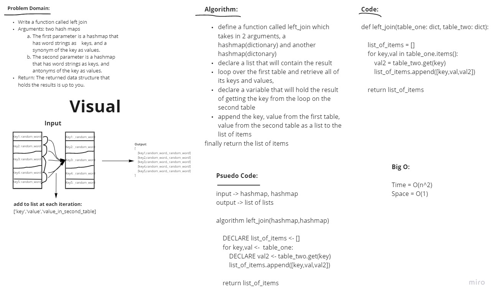

# Hashmap Left Join

* Write a function called left join
* Arguments: two hash maps
    The first parameter is a hashmap that has word strings as keys, and a synonym of the key as values.
    The second parameter is a hashmap that has word strings as keys, and antonyms of the key as values.
* Return: The returned data structure that holds the results is up to you. It doesn’t need to exactly match the output below, so long as it achieves the LEFT JOIN logic

## Whiteboard Process

## Approach & Efficiency

Approach:

Whiteboarding > Writing tests > Implemeting code and fixing as needed

Big O:

Time = O(n^2)

Space = O(1)

## Solution

[Code](hashmap_left_join.py)
