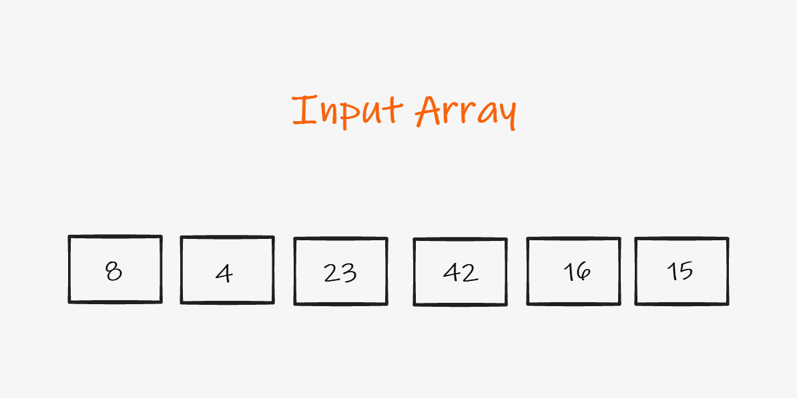
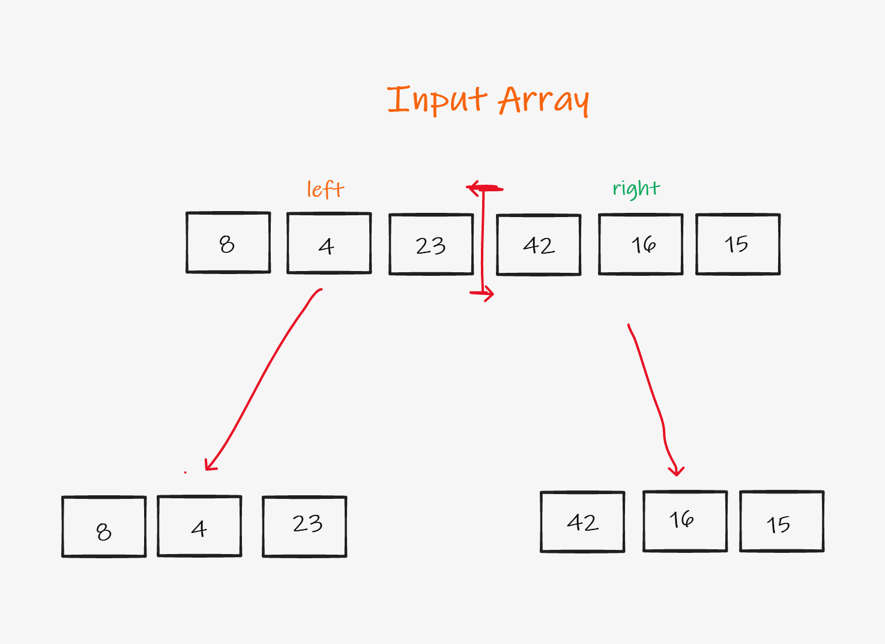
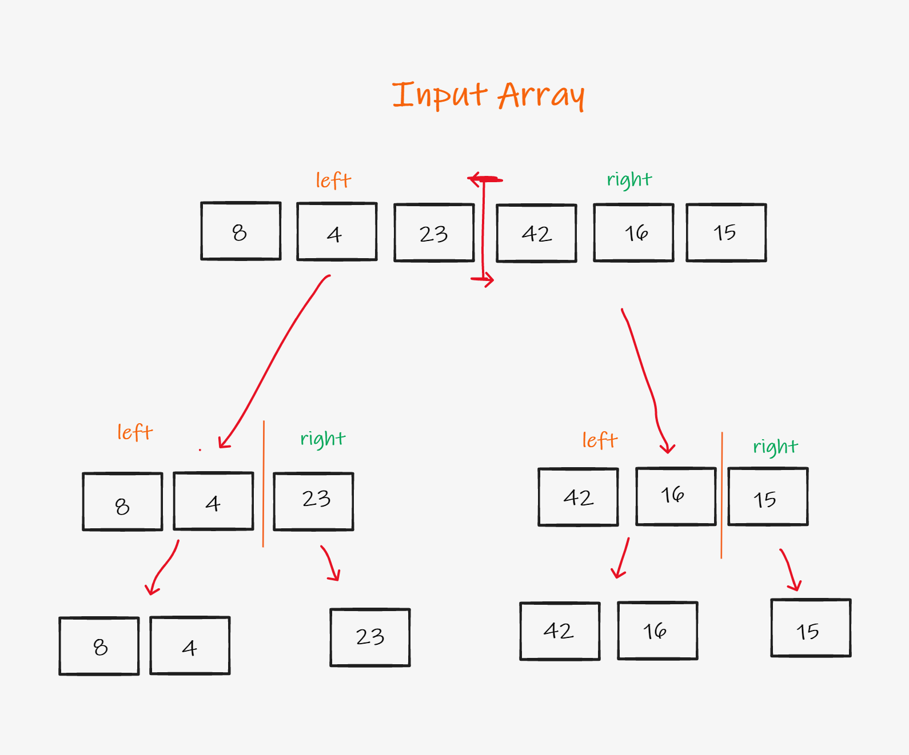
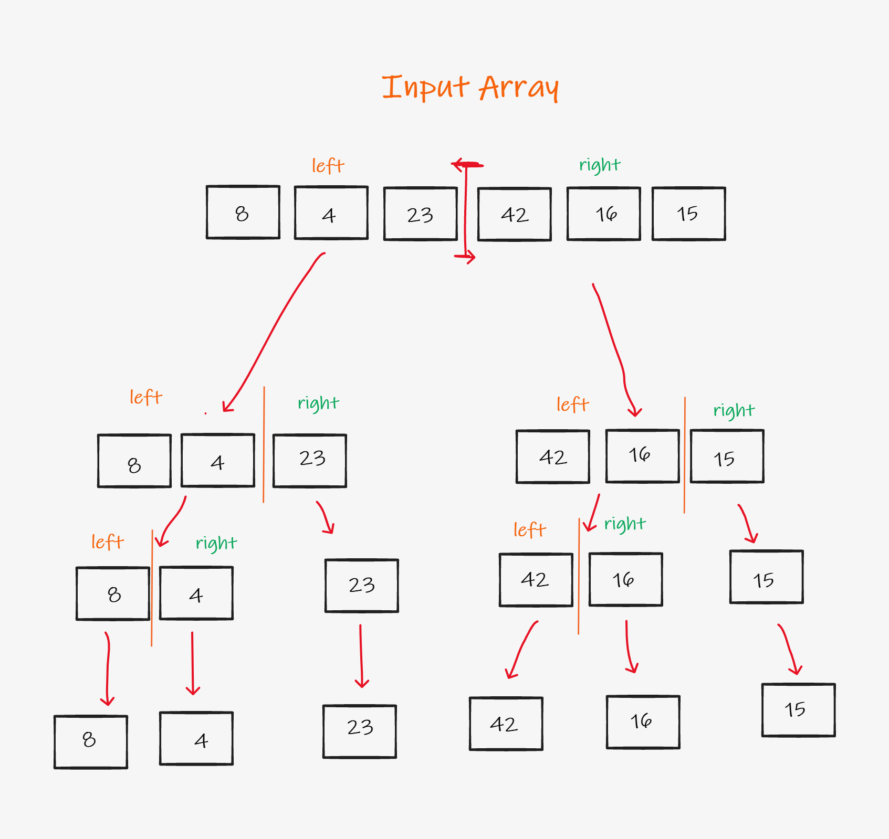
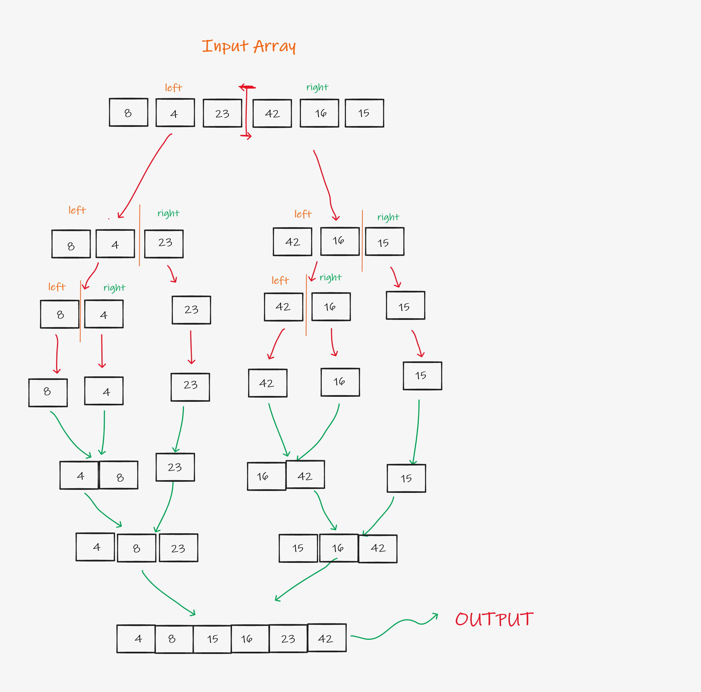

# Merge Sort

A more effcient method to sort an array.

Lets sort this array using merge sort

We first start by dividing the array into 2 parts, the left and right until they are simple enough to compare directly.

Then, if the elements are not simple enough to be compared directly, we repeat the same dividing process.

Then, if the elements are not simple enough to be compared directly, we repeat the same dividing process.

Now that we have each element of the original array as array of its own, we will start merging them back by comparing which element is higher.

Finally, we get the sorted array after comparing item by item and appending them in the right order.

# Big O:

Time: O(log n)
Space: O(log n)
