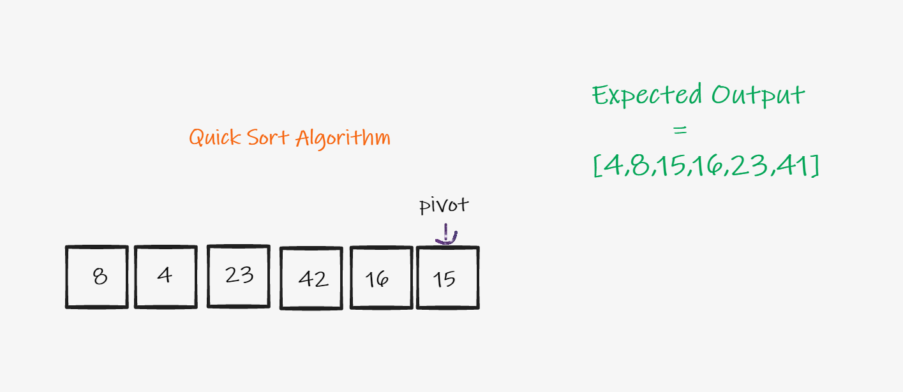

# Quick Sort

- Input array and the expected output.

- We first mark the pivot which in our case is the right element.

- The first two elements are compared with the pivot and they are swapped with them selves if the right condtion is met.

- The next 2 elements are greater than the pivot so they remain where they aee.

- The 16 is smaller than the last element is its replaced with the lowest available element.

- Finally, we reach the pivot, since its less than the previous element, we move it to the right postion.

- Final Output

# Big O

- Time = O(log n)

- Space = O(log n)
