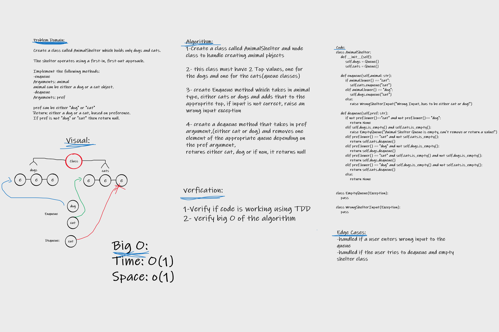

# Challenge Summary

### AnimalShelter Code Challenge
Create a class called AnimalShelter which holds only dogs and cats.
The shelter operates using a first-in, first-out approach.
Implement the following methods:
enqueue
Arguments: animal
animal can be either a dog or a cat object.
dequeue
Arguments: pref
pref can be either "dog" or "cat"
Return: either a dog or a cat, based on preference.
If pref is not "dog" or "cat" then return null.

## Whiteboard Process

## Approach & Efficiency

Approach:

Whiteboarding, Writing tests then fixing algorithm if there is something wrong with it.

Efficiency:

Time: O(1)
Space: O(1)

## Solution

Code Provided in [This File](stack_queue_animal_shelter/stack_queue_animal_shelter.py)

Tests are in [This File](tests/test_stack_queue_animal_shelter.py)
