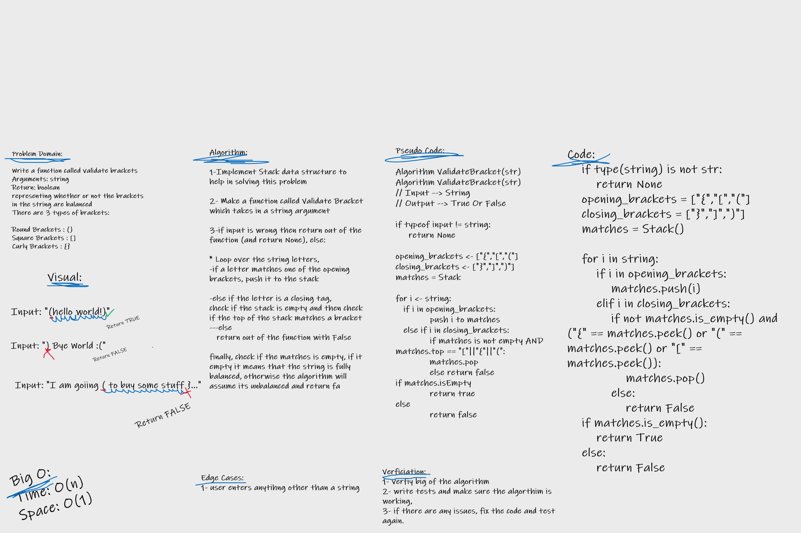

# Challenge Summary

### stack-queue-brackets

Write a function called validate brackets
Arguments: string
Return: boolean
representing whether or not the brackets in the string are balanced

## Whiteboard Process

## Approach & Efficiency

Approach:

White Boarding, Writing tests, rewriting algorithm / fixing issues

Efficiency:
Time: O(n)
Space: O(1)

## Solution

[Link To Code](stack_queue_brackets/stack_queue_brackets.py)

[Link To Tests](tests/test_stack_queue_brackets.py)
