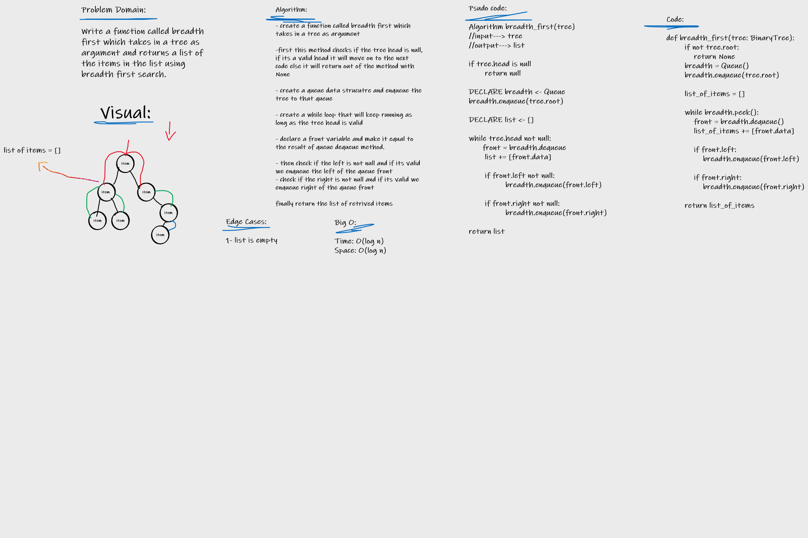

# Challenge Summary
Write a function called breadth first which traverses a tree following breadth-first apporach and returns a list of all values in the tree, in the order they were encountered

## Whiteboard Process

## Approach & Efficiency

Approach: White Boarding > TDD > Fixing Code

Efficiency:
    Time: O(log n)
    Space: O(log n)

## Solution

[Solution Code](tree_breadth_first.py)
