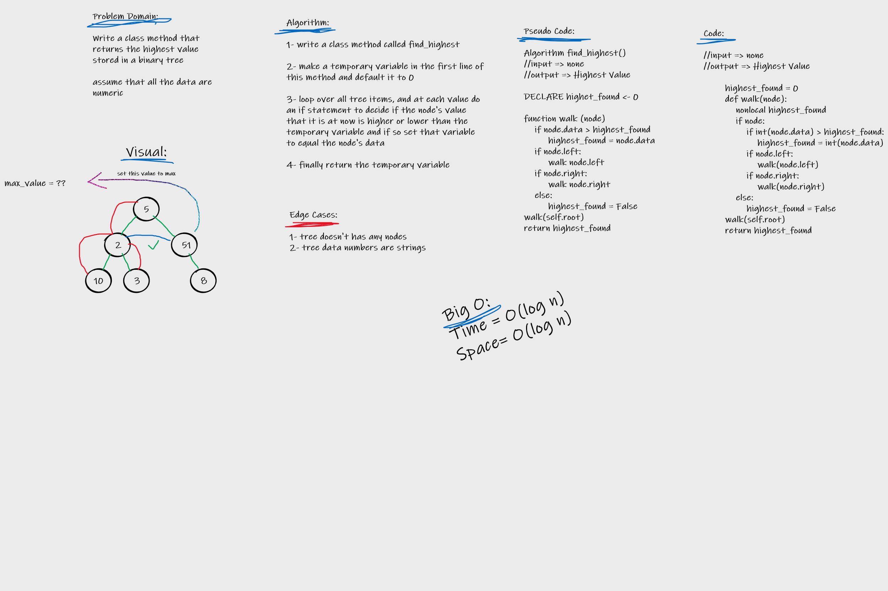

# Challenge Summary
Write a binary tree class method which finds the highest value in the tree and return it.

## Whiteboard Process

## Approach & Efficiency

Approach: White Boarding > TDD > Fixing Code

Efficiency:
    Time: O(log n)
    Space: O(log n)

## Solution

[Solution Code](tree_max.py)
